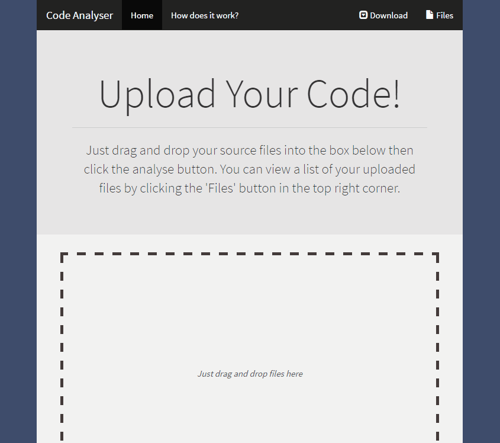

# Code Analyser 
  

I'm an prolific coder and one thing I like to know is how large my projects are. What I wanted was a simple web application that allows me to upload my source code and for it to tell me how many lines of code are part of that project and other additional information. This is what Coder Analyser is, it is a simple web app that gives me stats on any web project anywhere from any device.

## Overview

Code Analyser is a React based application which uses Webpack for module bundling. I use the HTML File API and Fetch API to take files and upload them onto a Node.js server. Once there, the node server does a quick analysis of the given files and returns the results as JSON. Once there this information is then dropped into a styled HTML table. Additionally the project uses Electron so a desktop version application is available and can be downloaded from the website itself. 

## Development

While I am not planning to add to this project in the near future there are many features I could implement, these potential options are listed below.

* More Details Analysis
* Export table to CSV
* Language Selection
* Make clearing files easier.

## License

Apache 2.0
